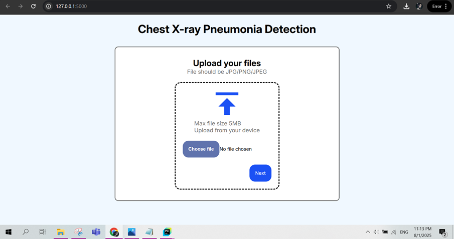
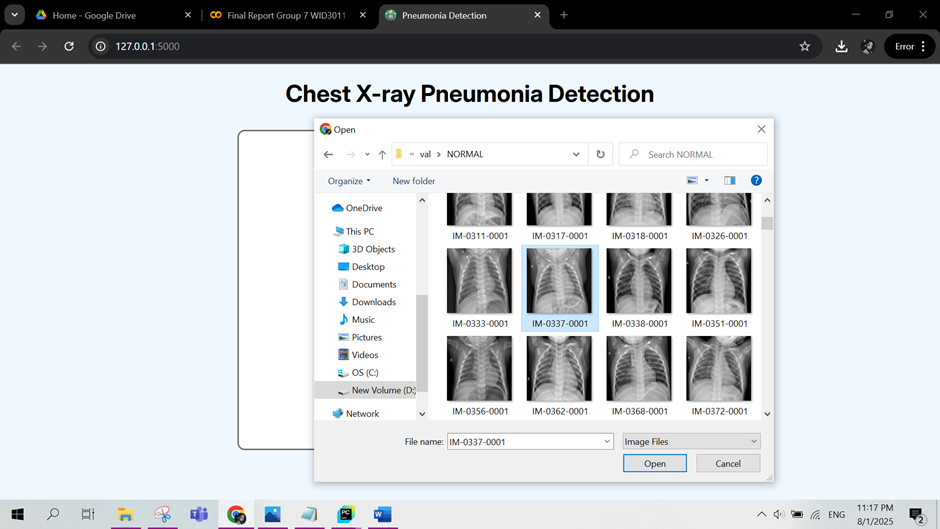
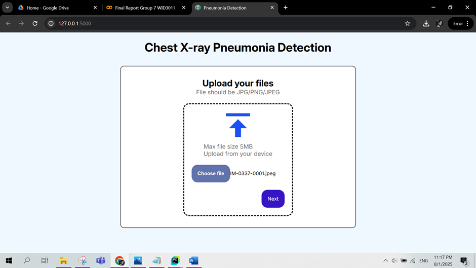
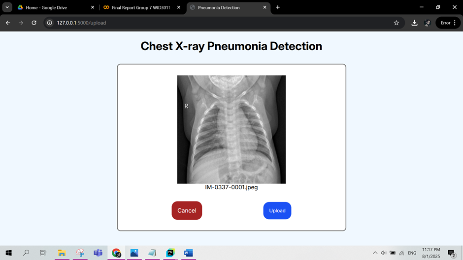
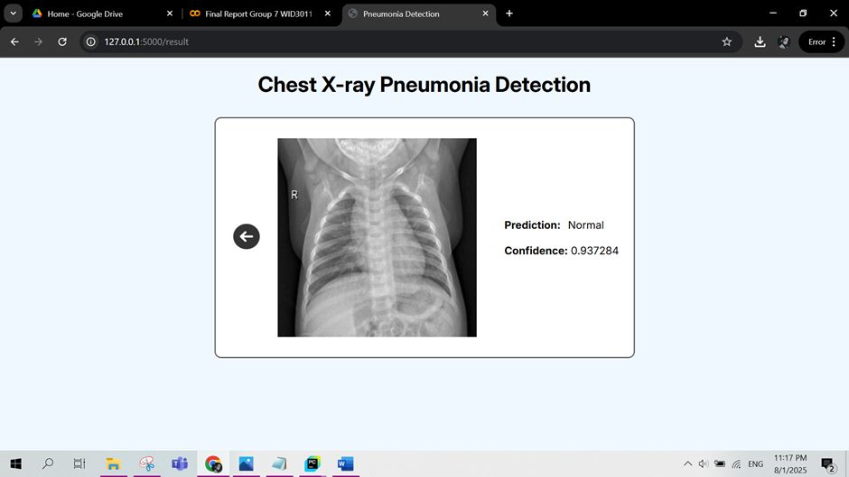

# WID3011 : DEEP LEARNING

Pneumonia Detection Using InceptionV3

SGD 3: Good Health & Well-being
Computer Vision Anomaly Detection

BY: GROUP 7

# Team Members

| No  | Name                                      |  Role             |
| --- | ----------------------------------------- |  ---------------- |
| 1   | Muhammad Khairul Amirin bin Yaacob        |  Project Leader, frontend developer, support backend developer   |
| 2   | Nur Fatiha Syuhada binti Azizi           | UI designer, InceptionV3 architecture                  |
| 3   | Muhammad Iqbal Qawim bin Kamarulzaman     | Hyperparameter tuning,support backend developer                  |
| 4   | Adam Muqri Bin Abdul Kahar               | Lead backend developer, introduction                 |
| 5   | Humyra Tasmia                             | Lead hyperparameter tuning, dataset preparation, UI designer  |

# Demonstration
1. The main page. User can see the Choose File button to upload chest X-ray photo from local device.
   

2. User can choose photo from device.
   
   
3. User can click Next button.
   
   
4. User will be brought to this confirmation page.
   
  
5. After clicking Upload button, user can see the prediction of X-ray and confidence level of detection.
   

